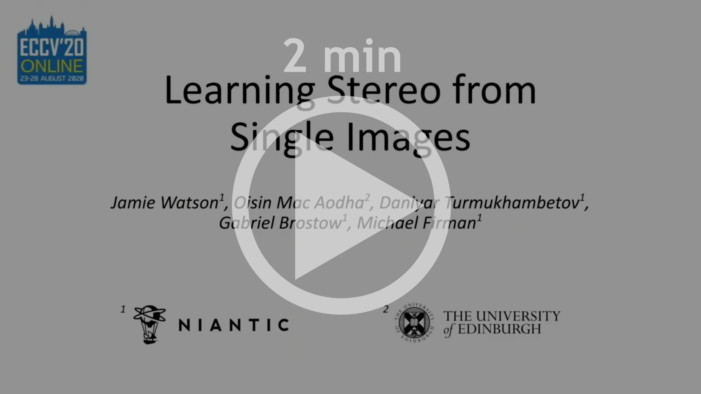
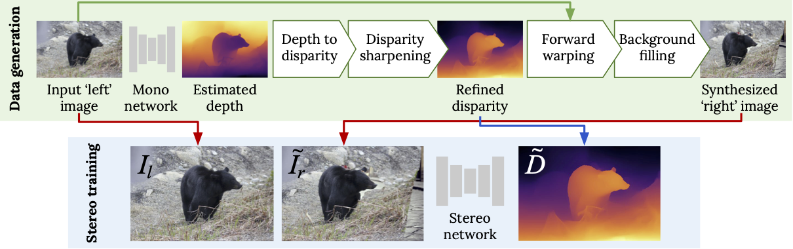
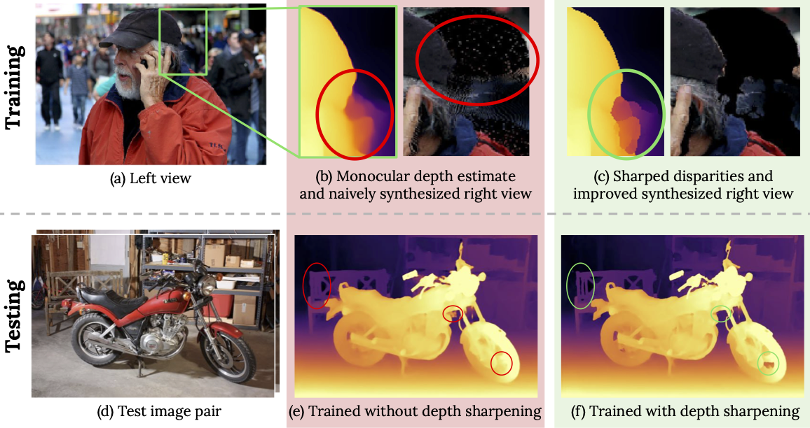
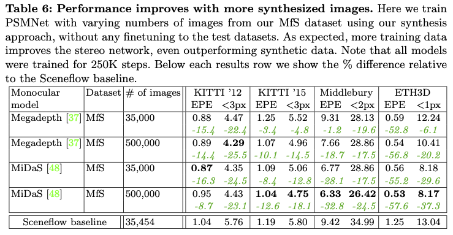

# [Learning Stereo from Single Images](https://arxiv.org/abs/2008.01484)

**[Jamie Watson](https://scholar.google.com/citations?view_op=list_works&hl=en&user=5pC7fw8AAAAJ), [Oisin Mac Aodha](https://homepages.inf.ed.ac.uk/omacaod/), [Daniyar Turmukhambetov](http://dantkz.github.io/about), [Gabriel J. Brostow](http://www0.cs.ucl.ac.uk/staff/g.brostow/) and [Michael Firman](http://www.michaelfirman.co.uk) – ECCV 2020 (Oral presentation)**


[Link to paper](https://arxiv.org/abs/2008.01484)  

<p align="center">
  <a href="https://storage.googleapis.com/niantic-lon-static/research/stereo-from-mono/short-video.mp4">
  
  </a>
</p>


<p align="center">
  <a href="https://storage.googleapis.com/niantic-lon-static/research/stereo-from-mono/long-video.mp4">
  
  </a>
</p>


<p align="center">
  
</p>

Supervised deep networks are among the best methods for finding correspondences in stereo image pairs. Like all supervised approaches, these networks require ground truth data during training. However, collecting large quantities of accurate dense correspondence data is very challenging. We propose that it is unnecessary to have such a high reliance on ground truth depths or even corresponding stereo pairs.

<p align="center">
  
</p>

Inspired by recent progress in monocular depth estimation, we generate plausible disparity maps from single images. In turn, we use those flawed disparity maps in a carefully designed pipeline to generate stereo training pairs. Training in this manner makes it possible to convert any collection of single RGB images into stereo training data. This results in a significant reduction in human effort, with no need to collect real depths or to hand-design synthetic data. We can consequently train a stereo matching network from scratch on datasets like COCO, which were previously hard to exploit for stereo. 

<p align="center">
  
</p>

Through extensive experiments we show that our approach outperforms stereo networks trained with standard synthetic datasets, when evaluated on  KITTI, ETH3D, and Middlebury. 

<p align="center">
  
</p>

## ✏️ 📄 Citation

If you find our work useful or interesting, please consider citing [our paper](https://arxiv.org/abs/2008.01484):

```
@inproceedings{watson-2020-stereo-from-mono,
 title   = {Learning Stereo from Single Images},
 author  = {Jamie Watson and
            Oisin Mac Aodha and
            Daniyar Turmukhambetov and
            Gabriel J. Brostow and
            Michael Firman
           },
 booktitle = {European Conference on Computer Vision ({ECCV})},
 year = {2020}
}
```


## 📊 Evaluation

We evaluate our performance on several datasets: 
KITTI ([2015](http://www.cvlibs.net/datasets/kitti/eval_scene_flow.php?benchmark=stereo) and [2012](http://www.cvlibs.net/datasets/kitti/eval_stereo_flow.php?benchmark=stereo)), 
[Middlebury](https://vision.middlebury.edu/stereo/submit3/) (full resolution) and [ETH3D](https://www.eth3d.net/datasets#high-res-multi-view) (Low res two view). 
To run inference on these datasets first download them, and update  `paths_config.yaml` to point to these locations.

Note that we report scores on the *training sets* of each dataset since we never see these images during training.

Run evaluation using:

```
CUDA_VISIBLE_DEVICES=X  python main.py \
  --mode inference \
  --load_path <downloaded_model_path> 

```
optionally setting `--test_data_types` and `--save_disparities`.

A trained model can be found [HERE](https://storage.googleapis.com/niantic-lon-static/research/stereo-from-mono/models/hourglass_midas_release.zip). 


## 🎯 Training

To train a new model, you will need to download several datasets: 
[ADE20K](https://groups.csail.mit.edu/vision/datasets/ADE20K/), [DIODE](https://diode-dataset.org/), 
[Depth in the Wild](http://www-personal.umich.edu/~wfchen/depth-in-the-wild/), 
[Mapillary](https://www.mapillary.com/dataset/vistas?pKey=1GyeWFxH_NPIQwgl0onILw)
 and  [COCO](https://github.com/nightrome/cocostuff). After doing so, update `paths_config.yaml` to point to these directories.
 
 Additionally you will need some precomputed monocular depth estimates for these images. 
 We provide these for MiDaS: [ADE20K](https://storage.googleapis.com/niantic-lon-static/research/stereo-from-mono/data/ADE20K.zip), [DIODE](https://storage.googleapis.com/niantic-lon-static/research/stereo-from-mono/data/diode.zip), 
[Depth in the Wild](https://storage.googleapis.com/niantic-lon-static/research/stereo-from-mono/data/diw.zip), 
[Mapillary](https://storage.googleapis.com/niantic-lon-static/research/stereo-from-mono/data/mapillary.zip)
 and  [COCO](https://storage.googleapis.com/niantic-lon-static/research/stereo-from-mono/data/mscoco.zip).
 Download these and put them in the corresponding data paths (i.e. your paths specified in `paths_config.yaml`).
 
 Now you can train a new model using:
 ```
CUDA_VISIBLE_DEVICES=X  python  main.py --mode train \
  --log_path <where_to_save_your_model> \
  --model_name <name_of_your_model>

```
Please see `options.py` for full list of training options.

# 👩‍⚖️ License
Copyright © Niantic, Inc. 2020. Patent Pending. All rights reserved. Please see the license file for terms.
